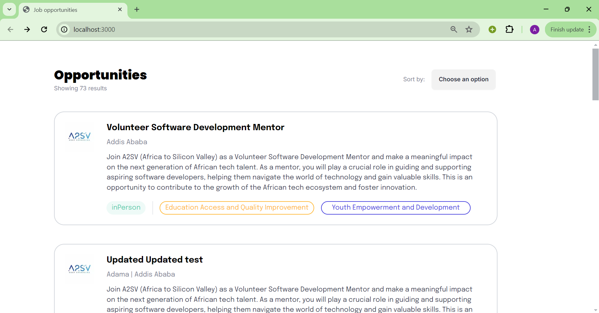
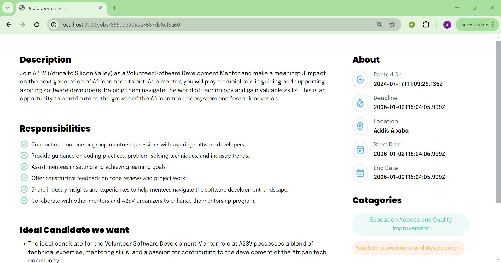
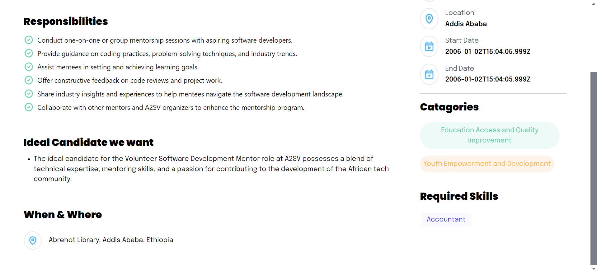

# Job_listing_with_api
This is a job listing application.

## List of jobs
When the page loads initially you should see the following page.



## Detail description of a job
If you click on a card you will see the following description of that page.




## To run the app
You should have node installed.
Clone the repository and install dependencies by running the following commands:
```bash
git clone https://github.com/AregawiF/Job_listing_with_api.git
cd Job_listing_app
npm install
npm run dev
''' then follow the link to launch the website.
